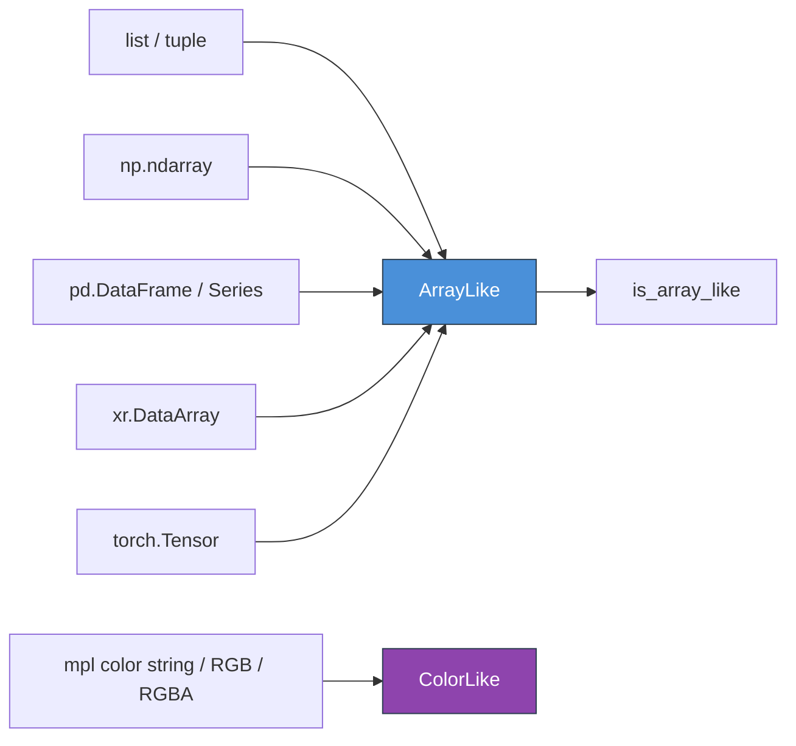
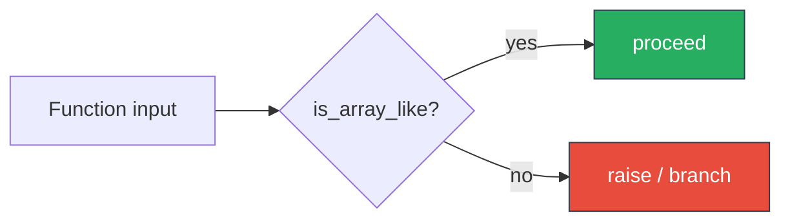

# scitex-types

<p align="center">
  <a href="https://scitex.ai">
    
  </a>
</p>

<p align="center"><b>Scientific type aliases (ArrayLike, ColorLike) + runtime validation predicates.</b></p>

<p align="center">
  <a href="https://scitex-types.readthedocs.io/">Full Documentation</a> · <code>uv pip install scitex-types[all]</code>
</p>

<!-- scitex-badges:start -->
<p align="center">
  <a href="https://pypi.org/project/scitex-types/"></a>
  <a href="https://pypi.org/project/scitex-types/"></a>
  <a href="https://github.com/ywatanabe1989/scitex-types/actions/workflows/rtd-sphinx-build-on-ubuntu-latest.yml"></a>
</p>
<p align="center">
  <a href="https://github.com/ywatanabe1989/scitex-types/actions/workflows/pytest-matrix-on-ubuntu-py3-11-3-12-3-13.yml"></a>
  <a href="https://codecov.io/gh/ywatanabe1989/scitex-types"></a>
</p>
<!-- scitex-badges:end -->

---

## Problem and Solution

| # | Problem | Solution |
|---|---------|----------|
| 1 | **`numpy.typing.ArrayLike` covers only NumPy** — functions that also accept Torch/DataFrame/Series need a hand-rolled `Union` | **`ArrayLike`, `ColorLike`** — stable aliases spanning `list/tuple/np.ndarray/pd.DataFrame/pd.Series/xr.DataArray/torch.Tensor` + matplotlib color inputs |
| 2 | **Runtime "is this a list of floats?" is a 3-line comprehension** | **`is_array_like()`, `is_list_of_type(lst, float)`** — clear predicates, no isinstance chain |

## Architecture

```
scitex_types/
├── _ArrayLike.py     # ArrayLike type + is_array_like predicate
├── _ColorLike.py     # ColorLike type
└── _is_listed_X.py   # is_list_of_type + is_listed_X predicates
```



<p align="center"><sub><b>Figure 1.</b> Type surface. Two aliases unify common scientific containers and matplotlib color inputs; predicates resolve membership at runtime.</sub></p>

## Installation

```bash
pip install scitex-types
# Optional: enable array-library matches (numpy + pandas + torch + xarray):
pip install scitex-types[all]
```

## Quick Start

```python
from scitex_types import ArrayLike, is_array_like, is_list_of_type

def process(data: ArrayLike) -> None: ...

is_array_like([1, 2, 3])           # True
is_list_of_type([1, 2, 3], int)    # True
```

## 1 Interfaces

<details open>
<summary><strong>Python API</strong></summary>

<br>

```python
from scitex_types import ArrayLike, ColorLike, is_array_like, is_list_of_type

# Type annotations
def process(data: ArrayLike) -> None: ...
def set_color(c: ColorLike) -> None: ...

# Runtime checks
is_array_like([1, 2, 3])           # True
is_array_like("not array")         # False
is_list_of_type([1, 2, 3], int)    # True
is_list_of_type([1, "x"], int)     # False
```

</details>

## Demo

```python
from scitex_types import ArrayLike, is_array_like, is_list_of_type

def normalize(x: ArrayLike) -> ArrayLike:
    assert is_array_like(x)
    return x

normalize([1, 2, 3])             # OK
normalize("not array")           # AssertionError

is_list_of_type([1, 2, 3], int)  # True — uniform int list
is_list_of_type([1, "x"], int)   # False — mixed
```



<p align="center"><sub><b>Figure 2.</b> Demo. Use <code>ArrayLike</code> in annotations, <code>is_array_like</code> as a one-line guard.</sub></p>

## Part of SciTeX

`scitex-types` is part of [**SciTeX**](https://scitex.ai). Install via
the umbrella with `pip install scitex[types]` to use as
`scitex.types` (Python) or `scitex types ...` (CLI).

>Four Freedoms for Research
>
>0. The freedom to **run** your research anywhere — your machine, your terms.
>1. The freedom to **study** how every step works — from raw data to final manuscript.
>2. The freedom to **redistribute** your workflows, not just your papers.
>3. The freedom to **modify** any module and share improvements with the community.
>
>AGPL-3.0 — because we believe research infrastructure deserves the same freedoms as the software it runs on.

## License

AGPL-3.0-only (see [LICENSE](./LICENSE)).

---

<p align="center">
  <a href="https://scitex.ai" target="_blank"></a>
</p>
